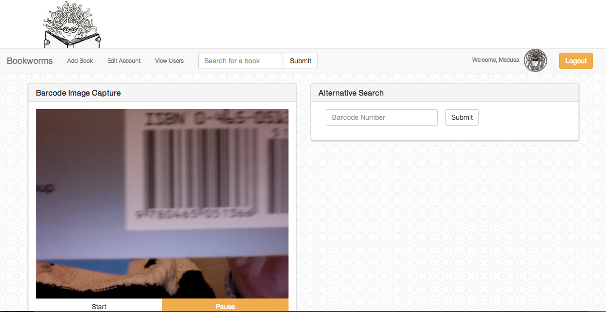
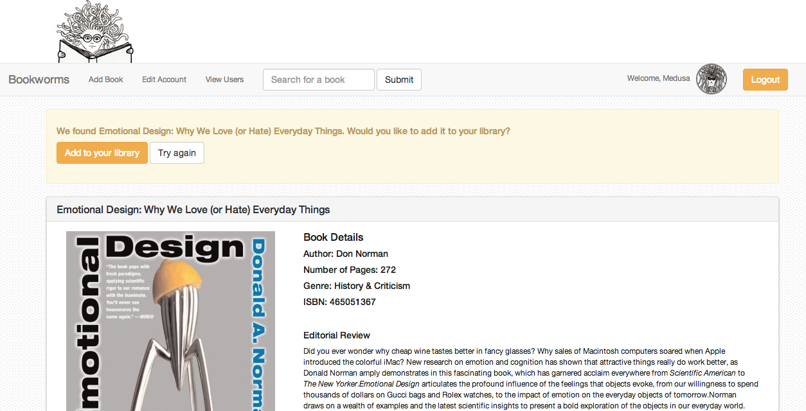
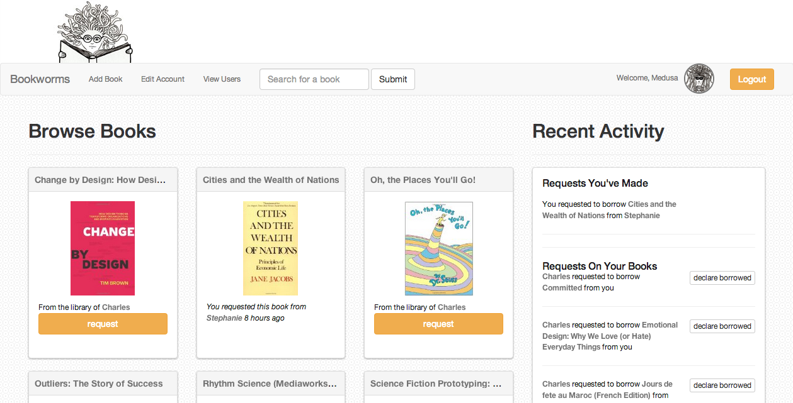

#Bookworms

Bookworms is a peer-to-peer physical book sharing web app with a barcode reader that uses a computer’s camera, HTML5 canvas and Amazon API. Once your books are saved to your library, you can share the books you’re really excited about with other people and not worry about losing them forever. Also, you can meet other super interesting people and arrange to borrow their books.

[Check out Bookworms here.](http://fathomless-wildwood-6941.herokuapp.com)

###Barcode Reader
####(camera.js & barcodeReader.js)
The barcode reader uses HTML5 canvas to take a snapshot every 50 milliseconds. There are four web workers that decode a barcode when it's flipped and not flipped, and from the right and left, respectively. (The latter two web workers are currently commented out). Once a barcode number is captured, the video screen stops rendering and the barcode number is used to query the Amazon Product API database.

 Right now, the barcode reader only works on 13 digit EAN numbers, and given the resolution of the typical (or at least, my macBook's) computer camera, it tends to work best on larger barcodes.

###Amazon Product API
####(amazon_search.py & view.py)
I query for one book at a time (SearchIndex = Books), always using the barcode (EAN) number. More specifically, I use ItemAttributes, BrowseNode and Images response groups to query for ISBN, title, author, genre, number of pages, image URL, thumbnail URL.

In order to avoid hitting the Amazon API all the time, Add Book queries first check the BookInfo table for existing information, and if none exists, the queries are redirected to Amazon's Product API and the results are saved to the the BookInfo table.

###Database
####(model.py)
The BookInfo table stores all resulting book information from Add Book queries, regardless of whether a user added the books to their library.

The Book table stores information pertaining to instances of books in users' libraries.

The BookTransaction table stores transaction states for books that have been requested, borrowed (as declared by the book's owner), returned (as indicated by the borrower), and confirmed by their owner as returned.

###Book Borrowing Transactions
####(views.py, index.html, library.html, book.html)

There can be multiple requests on a book, which all have their own BookTransaction ID, but a book cannot have multiple, concurrent borrowers. A transaction is considered "open" when the book's owner has declared that it's being borrowed. A transaction is considered "closed" when the book's owner has declared that their book is returned.

#####screenshot of the barcode reader in action

#####screenshot of the Amazon search results page

#####screenshot of the home page

